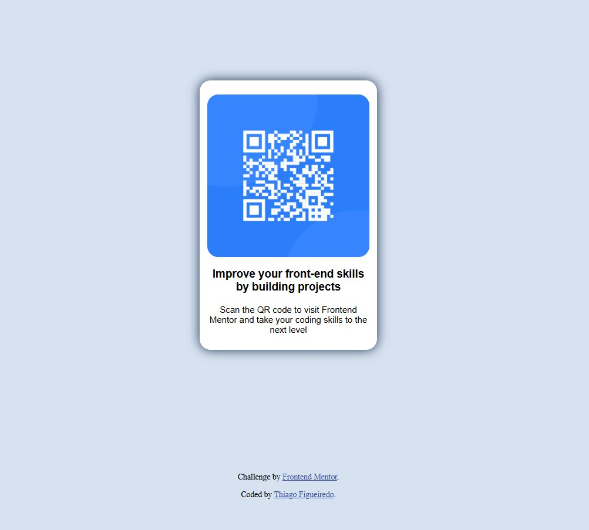

# Frontend Mentor - QR code component solution

This is a solution to the [QR code component challenge on Frontend Mentor](https://www.frontendmentor.io/challenges/qr-code-component-iux_sIO_H). Frontend Mentor challenges help you improve your coding skills by building realistic projects. 

## Table of contents

- [Resumo](#Resumo)
  - [Screenshot](#screenshot)
  - [Links](#links)
- [Meu processo](#meu-processo)
  - [Construido com:](#construido-com)
  - [O que eu aprendi](#o-que-eu-aprendi)
  - [Continuar desenvolvendo](#continuar-desenvolvendo)  
- [Autor](#autor)


## Resumo

### Screenshot




### Links

- Solution URL: [Add solution URL here](https://your-solution-url.com)
- Live Site URL: [Add live site URL here](https://your-live-site-url.com)


## Meu Processo

### Construido com

- Semantic HTML5 markup
- CSS custom properties
- Flexbox
- Mobile-first workflow


### O que eu aprendi

O desafio foi importante para relembrar e colocar em prática os conhecimentos de HTML e CSS.
Tendo destaque as configurações de responsividade. Forçou a rever e aprender novas formas de deixar o resultado responsivo à diversas telas.

Parte do Código que me deixou orgulhoso ao concluir

```css
    .conteinder_principal {
      width: 30vh;
      height: 45vh;
      margin: auto;
      padding: 10px;
      background-color: hsl(0, 0%, 100%) ;
      display: flex;
      justify-content: flex-start;
      flex-direction: column;
      align-items: center;
      border-radius: 15px;
      box-shadow: 0px 0px 15px hsl(218, 44%, 22%);
```


### Continuar desenvolvendo

Nos proxímos projetos e desafios prentendo deixar mais ágil os ajustes responsivos do site ou aplicação.
Aprofundar os conhecimentos e compressão, para que eu fique também responsivo às situções adiante.


## Autor

- Website - [THIAGO FIGEUIREDO](https://github.com/ThiagoFigueiredoTeixeira)
- Frontend Mentor - [@ThiagoFigueiredoTeixeira](https://www.frontendmentor.io/profile/ThiagoFigueiredoTeixeira)


